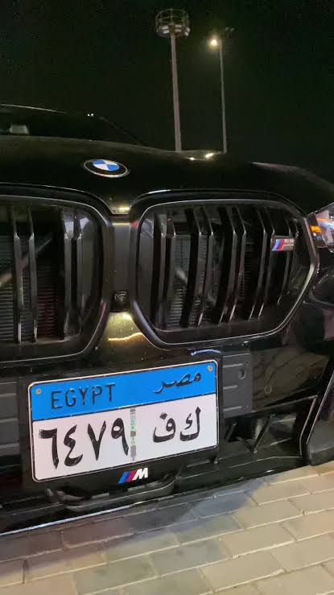
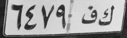
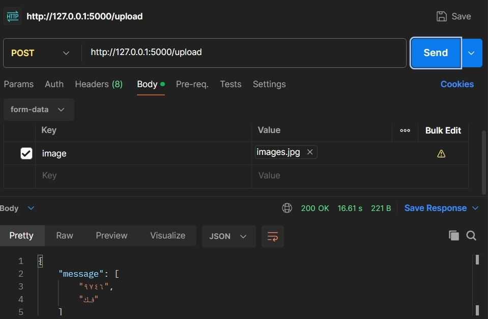

# License_Plate_OCR — Egyptian Plate Detection + OCR

Graduation project backend for detecting Egyptian license plates and extracting Arabic letters + numbers from images/video frames.

> **Design goal:** reliably **identify the vehicle** across frames/conditions, not to squeeze the last 1% of character accuracy on a single perfect crop. Detection **consistency** (same car → same output over time) matters more than isolated OCR exact-match — see [Philosophy](#philosophy-consistency--accuracy).

## Stack

* **Server:** `Flask` (`app.py:118`) — `POST /upload`
* **Detection:** `YOLO` (`best.pt` — YOLOv8/YOLO11n, 5.4 MB) — `app.py:17`
* **Geometry:** OpenCV `Canny` + `HoughLinesP` deskew + `warpAffine` + second YOLO pass for tight crop — `app.py:71`
* **Enhancement:** `EDSR x4` super-resolution (`EDSR_x4.pb` 38 MB) via `cv2.dnn_superres` — `app.py:12`
* **OCR:** `PaddleOCR` (`lang='ar'`, `use_angle_cls=True`, loaded once globally) — `app.py:20`

## Process — End-to-End Pipeline

```
Input image (file upload)
  │
  ├─ 1. YOLO detect — app.py:64  model(image) → boxes.xyxy (conf/IoU filtering)
  │     crop_plate_with_margin(margin=0.5) — app.py:48 — padded plate crop
  │
  ├─ 2. Deskew — app.py:74
  │     plate → GRAY → Canny(50,200) → HoughLinesP → median angle
  │     rotate_image() — app.py:36 — expands canvas, no cropping
  │     re-run YOLO on rotated full frame → tighter box (margin -0.05) — app.py:88
  │     fallback: deskewed plate directly if re-detect fails — app.py:91
  │
  ├─ 3. Normalize — app.py:23  preprocess_image()
  │     keep bottom strip to enforce ~10:3 Egyptian plate ratio → GRAY
  │     (currently cropping; padding is more robust — planned)
  │
  ├─ 4. Upscale — app.py:104  sr.upsample(x4) single pass (was double 16x)
  │     saved as rec_neoplate_before/after.jpg
  │
  └─ 5. OCR — app.py:107  ocr.ocr(result, cls=True) → texts[]
        returned as {"message": ["..."]} — app.py:132
```

`client.py` and `tester.py:190` provide single-file and batch `images/` evaluation modes.

## Example — Input → Detection → Upscale → Final Result

| Stage | File | Description |
|-------|------|-------------|
| **1. Input** | `images.jpg` | Original image sent to `POST /upload` |
| **2. Detection (before upscale)** | `rec_neoplate_before.jpg` | Tight YOLO crop after deskew + `preprocess_image()` gray 10:3 normalization (`app.py:100`) |
| **3. After EDSR x4** | `rec_neoplate_after.jpg` | Same crop upscaled 4× via `EDSR_x4.pb` (`app.py:104`) before OCR |
| **4. Final result** | `result.jpeg` (`result.jpg`) | OCR-annotated / returned plate text visualization |

### 1. Input — `images.jpg`


### 2. License plate detection — `rec_neoplate_before.jpg`


### 3. After upscaling (EDSR x4) — `rec_neoplate_after.jpg`


### 4. Final result — `result.jpeg`


> `rec_neoplate_before.jpg` / `rec_neoplate_after.jpg` are written by `app.py:100,106` on every request. `result.jpeg` is a copy of `result.jpg` for README compatibility; both point to the same visualization.

## Philosophy: Consistency > Accuracy

For **vehicle identity**, the system must return the **same plate for the same car** under blur, angle, night, distance:

* A detector that fires 98% of frames with 92% char accuracy is more useful than one that hits 99% accuracy but only on 60% of frames (misses = lost car).
* Metrics to optimize first: **detection recall / mAP@0.5, track consistency (ID switch rate), temporal stability** — then **Character Error Rate (CER)** / exact-match.
* Practical consequence: favor stable preprocessing (fixed 10:3 normalization, conservative deskew threshold), confidence filtering, and temporal voting across N frames over per-frame heroics. A wrong-but-consistent read can be corrected by format rules or multi-frame majority vote; a missed detection cannot.

**What that means for this repo:**

* Keep YOLO tuned for recall (lower `conf`, `imgsz=640→1280`, NMS 0.5) and log every miss.
* Only deskew if `|angle| > 2°` and filter `Hough` outliers to `[-30°,30°]` — avoid jitter.
* Apply `EDSR` conditionally (small plates only) + `CLAHE`/denoise; cache OCR with `drop_score` threshold.
* Post-process with Egyptian format regex `^[أ-ي]{2,4}\s*[0-9]{3,4}$` + lexicon normalization and multi-frame voting rather than chasing single-frame perfection.

If your evaluation is single-image exact-match, report both: `Detection Recall` and `OCR CER` separately — don't conflate them into one "accuracy".

## Quick Start

```bash
pip install flask ultralytics opencv-python paddleocr numpy requests
# or: pip install -r requirements.txt

python app.py                 # -> http://127.0.0.1:5000
python client.py ./images.jpg # single upload test
python tester.py              # batch over images/ (legacy, no Flask)
```

**API**

```http
POST /upload  Content-Type: multipart/form-data  field: image=<file>
-> 200 {"message": ["ن ص 1234"]}  |  400 {"error": "..."}  |  [] if no plate
```


